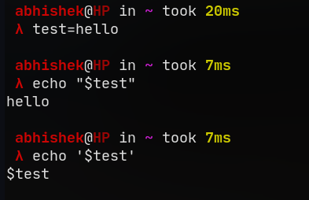
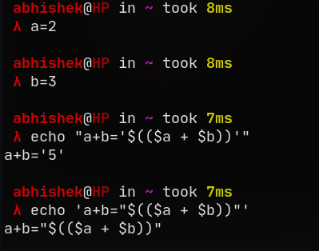

# Task1

## Problem 1
1. List all python files using  ```ls *.py```  command and save it as an array.
2. Iterate through the array using ```for``` loop and if it's a file then move ```.py``` files to ```.c``` using ```mv``` command with replacing the variable name using regex.
3. If no ```.py``` files are found, then exit.

## Problem 2
1. List all C files using  ```ls *.c```  command and save it as an array.
2. Print all C files using ```for``` loop. Taking input to compile and run the program.
3. In order to run multiple commands inside the opened terminal,
   1. Combine all commands using ```&&``` or ```;```
   2. Store combined command in a variable
   3. Run it through bash command using ```bash -c``` , so that it acts as a single command.
4.  I used ```x-terminal-emulator -e ``` so that it can be used universally, not only in Ubuntu.

## Problem 3
1. Checked for root privileges using ```id -u``` which returns 0 for root user.
2. Checked for internet connection using "GNU netcat" : ```nc -zw1 8.8.8.8 443```
   - By connecting to Google's DNS server (8.8.8.8) on https port (443).
   - With a timeout of 1sec if not connecting.
   - This has an exit code of 0 if successfull.
3. Ran all the commands given in the wiki page in the same order, by removing "sudo" as the user required is already root.

## Problem 4

| **"Double Quotes"** | **'Single Quotes'** |
| :------------------: | :-----------------: |
| This interprets different meaning for some special charcters like doller sign(**'$'**) , backslash(**'\\'**) , backtick(**`**) , exclaimation mark(**!**) , etc | This just holds on to the literal values |

| Examples | |
| --- | --- |
|  |  |

## Problem 5

| `rovername=vajra` | `export rovername=vajra` |
| ---| --- |
| This is a shell variable | This is a shell variable which is also exported to all child processes |
| When run directly in shell/terminal, variable cannot be used by bash script run by shell/terminal | When run directly in shell/terminal, variable can also be used by bash script run by shell/terminal |

- **Note:** In case of **export**, when used inside a child process, it won't be exported to the parent process.

## Problem 6
- Just used grep command to search recursively in all the files in the directory.
   - ```grep -r "$string"```
- Also added an option to pass the directory to search in by passing in as the 1st arguement.